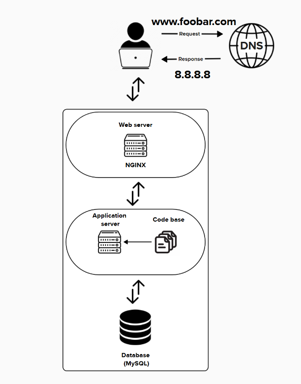

# 🌐 Web Architecture – Key Concepts

Here is a simple web stack of an application

---

## 🖥️ What is a Server?

A **server** is a computer or software system that provides services, data, or resources to other computers called **clients**, over a network.

> 📩 When a customer visits a website, their computer (the client) sends a **request** to the **server** where the website is hosted.

---

## 🌍 What is the Role of the Domain Name?

A **domain name** is a human-readable address used to identify a website (e.g., `www.foobar.com`).

- `www` is the **subdomain**
- `foobar.com` is the **root domain**
  
> 🔧 Unlike an IP address (e.g., `8.8.8.8`), which is computer-readable, a domain name is **easier for humans to remember**.

---

## 📡 What is the Role of the Web Server?

The **web server**:

- Receives **HTTP requests** from clients (like browsers)
- **Forwards requests** to the application server
- **Serves static files** such as:
  - HTML
  - CSS
  - JavaScript
  - Images

> 🛠 Common web servers: **NGINX**, **Apache**

---

## ⚙️ What is the Role of the Application Server?

The **application server**:

- Processes requests received from the web server
- **Handles business logic**
- **Communicates with the database** to fetch or store data
- Generates **dynamic responses** for the client

> 🔁 It connects the web interface to the core logic of the application.

---

## 🗄️ What is the Role of the Database?

A **database** is responsible for:

- **Storing** data (e.g., users, orders, content)
- **Organizing** and indexing it
- **Managing access** (read, write, update, delete)
- **Retrieving data efficiently** via queries (e.g., SQL)

> Example: MySQL, PostgreSQL, MongoDB

---

## 🔐 What is the Server Using to Communicate with the User?

The server communicates with the user's device using:

- **HTTP (Hypertext Transfer Protocol)**
- **HTTPS (HTTP Secure)** – adds encryption via **TLS/SSL**

> ✅ HTTPS is preferred because it **secures** data in transit and **protects privacy**.

---

## ⚠️ Infrastructure Limitations – Monolithic Architecture

### 🔴 Single Point of Failure (SPOF)
- The entire website goes down if the server fails.
- No redundancy or backup systems.
- All components (web server, application server, database) are on the **same machine**.

### ⛔ Downtime When Maintenance Is Needed
- The whole site must be taken offline for updates.
- Any component update requires a **full server restart**.
- No **zero-downtime deployment** strategy in place.
- Database maintenance affects the entire application.

### 🚫 Cannot Scale with High Traffic
- Limited by the physical server's **CPU, RAM, and storage**.
- Cannot handle **heavy traffic loads** effectively.
- No **load balancing** to distribute traffic.
- **Database becomes a bottleneck** under stress.
- No **horizontal scaling** (adding more machines is not possible with this setup).

---