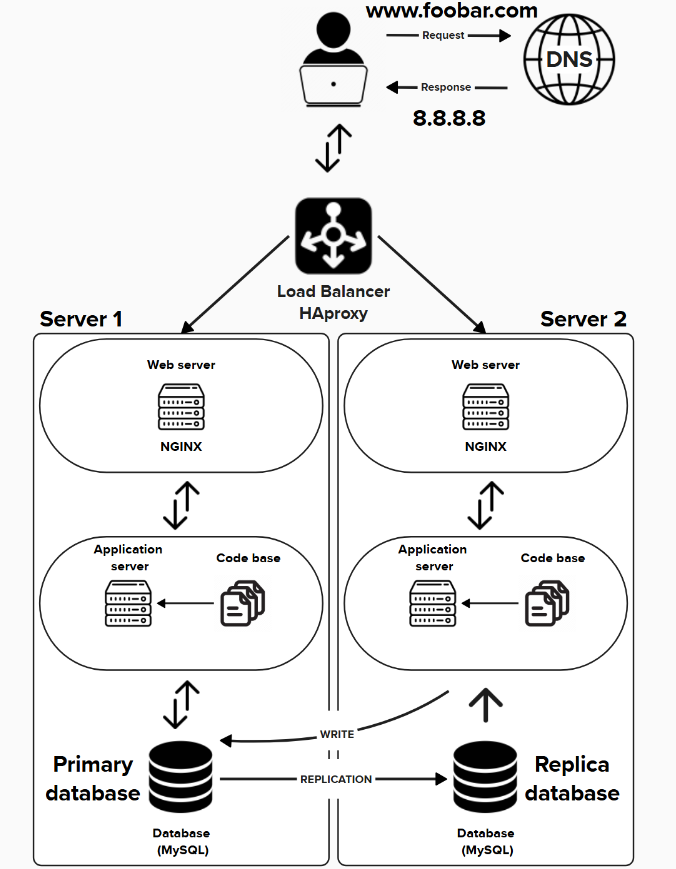

# ⚙️ Improved Web Infrastructure – Scalable & Redundant Architecture

Here is a schema of distributed web infrastructure

---

## ✅ Requirements – What Was Added

### 1️⃣ Load Balancer – **HAProxy**

- **Purpose**: Distributes incoming traffic between multiple servers to ensure availability and scalability.
- **Why?** Prevents a single server from being overloaded and provides **fault tolerance**.

---

### 2️⃣ Application Servers (x2)

Each server includes:
- **1 Web Server (Nginx)**: Handles HTTP/HTTPS requests and serves static content.
- **1 Application Server**: Executes business logic and processes dynamic requests.
- **1 Codebase**: Your deployed application files.

> 🧱 Redundant architecture: If one server fails, the other can still handle traffic.

---

### 3️⃣ Database – **MySQL Primary-Replica Cluster**

- **1 Primary (Master) Node**
- **1 Replica (Slave) Node**

> 🗃 The Primary handles **read/write** operations, while the Replica handles **read-only** operations and acts as a **failover backup**.

---

## 🔍 Infrastructure Details & Justifications

### 🔁 Load Balancing Algorithm

- **Algorithm Used**: **Round Robin**
  - Evenly distributes requests across servers in a rotating order.
  - Simple and effective for handling stateless web traffic.

### ⚖️ Active-Active vs Active-Passive

- **Current Setup**: ✅ **Active-Active**
  - Both servers handle traffic simultaneously.
  - If one fails, the other continues without interruption.
  
> 🔄 **Difference**:
> - **Active-Active**: All nodes are live and share the load.
> - **Active-Passive**: One node is active, the other is on standby (passive) and takes over only if the active one fails.

---

### 🗄️ Database Cluster – Primary-Replica (Master-Slave)

- The **Primary node**:
  - Handles all **write operations** (INSERT, UPDATE, DELETE).
  - Sends changes to replicas through replication.
  
- The **Replica node**:
  - Receives **read-only traffic** from the application.
  - Keeps in sync with the Primary via binary log replication.

> 💡 Helps offload reads and provides a backup for failover.

---

## ⚠️ Limitations & Risks of This Improved Architecture

### 🔴 Single Points of Failure (SPOF)

- If the **load balancer** fails → the whole system becomes unavailable.
- If the **Primary database** fails and no failover mechanism is in place → writes are impossible.

### 🔐 Security Weaknesses

- ❌ No **firewall** or security rules (e.g., blocking ports, restricting IPs).
- ❌ No **HTTPS** for encrypted communication (only HTTP by default).
  
> ✅ Solution: Use **TLS certificates** and configure **firewall rules**.

### 📉 No Monitoring

- There's no **monitoring** or **alerting system** in place:
  - No visibility into CPU, memory, or disk usage.
  - No alert if a server or service goes down.

> ✅ Solution: Add tools like **Sumologic**.

---

## 📊 Summary

| Component         | Role                                              | Justification                                 |
|-------------------|---------------------------------------------------|-----------------------------------------------|
| Load Balancer     | Distributes traffic across servers                | Increases availability & scalability           |
| Web/Application Servers | Host the app and serve requests         | Redundancy, parallel processing                |
| Primary DB (MySQL) | Main data storage (read/write)                   | Centralized data control                       |
| Replica DB         | Backup & read-only traffic                       | Performance boost and failover readiness       |

---

## 🚧 Improvements Still Needed

- Add **failover for load balancer** (e.g., Secondary HAProxy).
- Implement **HTTPS** and **firewall rules**.
- Deploy a **monitoring stack** for real-time status and alerting.

---
