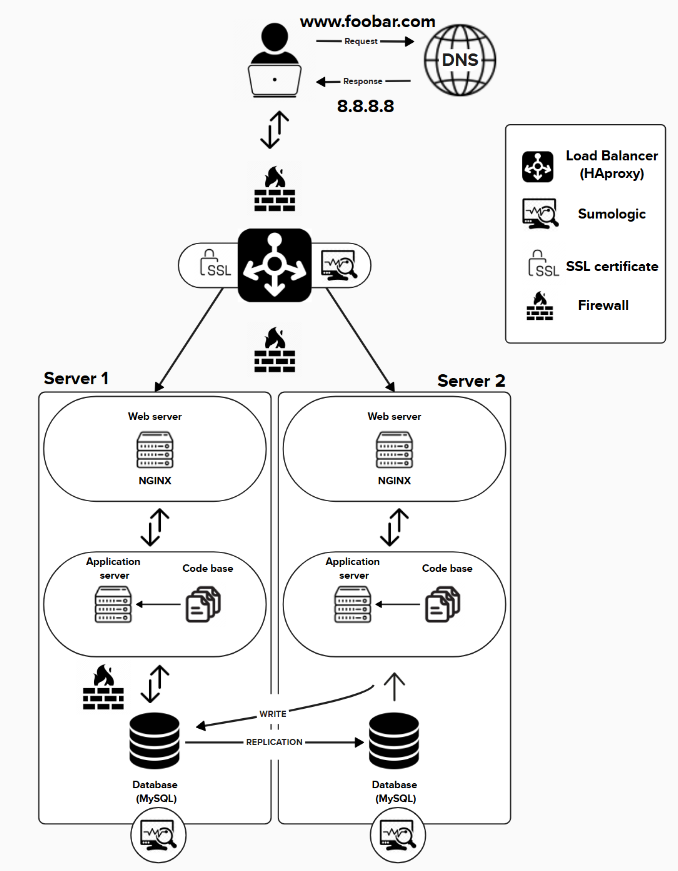

# 🛡️ Secure and Monitored Web Infrastructure

Here is an overview of implemented features

---

## ✅ New Requirements Implemented

### 🔒 1. Firewalls (x3)

**Where?**
- 1 before the Load Balancer
- 1 before each Server (Server 1 and Server 2)

**Purpose:**
- Restrict unauthorized access to the system.
- Block unused or dangerous ports (e.g., only allow 80, 443, 3306).
- Protect against basic attacks like DDoS and port scanning.

> 🔐 **Firewalls act as a security barrier** between the internal network and the outside world.

---

### 🔐 2. SSL Certificate

**Used For:** Serving `https://www.foobar.com`

**Why HTTPS?**
- Encrypts data transmitted between the client and server.
- Prevents data interception, tampering, and man-in-the-middle attacks.
- Boosts user trust and SEO rankings.

> ✅ Secure communication is **essential** for any public-facing application.

---

### 📈 3. Monitoring Clients (e.g., Sumologic agents)

**Installed on:**  
- Load Balancer  
- Server 1  
- Server 2  

**Purpose:**
- Collects logs and metrics (CPU, RAM, disk usage, traffic, errors).
- Sends them to a centralized platform like **Sumologic** or **Prometheus**.

> 📊 Monitoring enables **real-time visibility**, **performance analysis**, and **incident detection**.

---

## 🔍 Technical Deep Dive

### 🧪 What Monitoring Tools Do

- Track server metrics, errors, and request data.
- Detect unusual patterns or failures (e.g., CPU spikes, 500 errors).

**How it works:**
- Each server runs a **data collector agent**.
- These agents gather system and application logs.
- The data is sent to Sumologic for storage, visualization, and alerts.

---

### 📊 How to Monitor Web Server QPS (Queries Per Second)

1. Enable **access logs** in NGINX.
2. Use a **log parser or agent** to extract request timestamps.
3. Send the data to a **dashboard** (e.g., Sumologic or Grafana).
4. Create a metric to count requests per second.

---

## ⚠️ Issues Remaining in This Infrastructure

### ❗ SSL Termination at the Load Balancer

**Issue:**
- SSL is decrypted at the load balancer.
- The traffic between the load balancer and backend servers is in **plain HTTP**.

**Risk:**
- If the internal network is compromised, sensitive data can be sniffed.

> ✅ **Fix**: Use **end-to-end encryption** (re-encrypt traffic between LB and backend).

---

### ❗ Single Writeable MySQL Server

**Issue:**
- Only one server can handle **writes**.
- If it fails → no more writes are possible, even if the replica is running.

**Risk:**
- **Data availability risk** and potential **data loss**.

> ✅ **Fix**: Use automatic failover (e.g., **MHA**, **Orchestrator**, or **Group Replication**).

---

### ❗ Identical Architecture on Both Servers

**Issue:**
- Each server has **Web + App + Database**.

**Problems:**
- Difficult to **scale** each layer independently.
- Harder to **optimize resources** (e.g., DB needs more IOPS, Web less).
- **Maintenance becomes complex** (risk of tight coupling).

> ✅ **Fix**: Use separate tiers (e.g., dedicated DB servers, app clusters, web nodes).

---

## 🧠 Summary Table

| Component       | Purpose                                       | Benefit                                         |
|----------------|-----------------------------------------------|--------------------------------------------------|
| 🔥 Firewalls     | Filter and block unauthorized traffic         | Prevent intrusions and secure the perimeter      |
| 🔐 SSL Certificate | Secure HTTP traffic via HTTPS             | Encrypts data and boosts trust                   |
| 📈 Monitoring    | Collect logs/metrics from all components     | Enables visibility, alerts, and diagnostics      |
| ⚖️ Load Balancer | Distributes traffic and offloads SSL         | Ensures high availability and performance        |
| 🛢 MySQL Primary/Replica | Supports read scaling and data redundancy | Better performance and availability         |

---

## 🛠 Recommendations to Improve Further

- Add **SSL between load balancer and backend** (TLS passthrough or re-encrypt).
- Separate database servers from web/app servers.
- Enable **automatic database failover**.
- Add **alerting rules** in monitoring tools (e.g., disk full, QPS too high).

---
