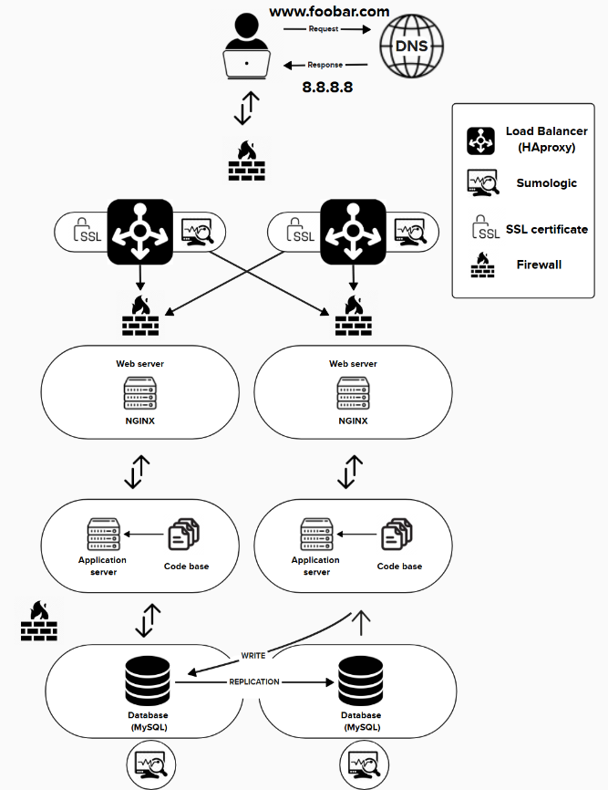

# 🌐 Scalable and Resilient Infrastructure with Load Balancer Cluster and Split Components

Here's an overview of the improvements made to the application

---

## ✅ Newly Added Components

| Component                         | Description                                                                  |
|----------------------------------|------------------------------------------------------------------------------|
| 🖥️ 1 Additional Server             | Allows isolation of services (web/app/db) on different machines.             |
| ⚖️ HAProxy Load Balancer (Cluster) | Two HAProxy load balancers configured in a cluster for high availability.    |
| 🔧 Split Web, App, and DB Servers  | Each service runs on a dedicated server, improving performance and security. |

---

## 🔍 Why These Components Were Added

### 🖥️ Additional Server
- ➕ Increases **fault tolerance** and infrastructure **flexibility**.
- ➕ Helps with **horizontal scalability**.
- ➕ Isolating services makes maintenance easier and safer.

### ⚖️ HAProxy Cluster
- ➕ Ensures **no single point of failure (SPOF)** at the load balancing layer.
- ➕ Load is **distributed** across multiple backend servers.
- ➕ Cluster setup means one HAProxy can fail and traffic still flows.

### 🔧 Split Components
- **Web Server (NGINX)**: Handles HTTP/S requests and serves static assets.
- **Application Server**: Executes business logic and interfaces with the database.
- **Database Server (MySQL)**: Manages data storage, replication, and queries.

---

## ⚙️ Load Balancing Configuration

- **Algorithm**: `Round-robin` or `Least Connections`
  - ➤ Distributes requests evenly or sends to the server with the fewest connections.
- **Mode**: `Active-Active`
  - ➤ Both load balancers are working and sharing traffic at the same time.
  - ➤ If one fails, the other continues without downtime.
  - ➤ Compared to `Active-Passive`, where only one is active and the second is on standby.

---

## 🎯 Benefits of This Architecture

- ✅ High availability and redundancy.
- ✅ Load is evenly distributed across resources.
- ✅ Easy horizontal scaling of each layer independently (Web/App/DB).
- ✅ Maintenance on one server does not impact the entire system.
- ✅ Improved security and performance with service isolation.

